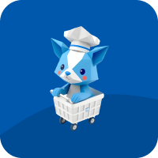

[![Contributors][contributors-shield]][contributors-url]
[![Forks][forks-shield]][forks-url]
[![Stargazers][stars-shield]][stars-url]
[![Issues][issues-shield]][issues-url]
[![MIT License][license-shield]][license-url]
[![LinkedIn][linkedin-shield]][linkedin-url]

<!-- PROJECT LOGO -->
 

  

  <h3 align="center">PocketList</h3>

  

    An awesome app to keep everything you want at the reach of your hand!
     
    <a href="https://github.com/m0liveira/PocketList"><strong>Explore the docs »</strong></a>
     
     
    <a href="https://github.com/m0liveira/PocketList">View Demo</a>
    &middot;
    <a href="https://github.com/m0liveira/PocketList/issues/new?labels=bug&template=bug-report---.md">Report Bug</a>
    &middot;
    <a href="https://github.com/m0liveira/PocketList/issues/new?labels=enhancement&template=feature-request---.md">Request Feature</a>
  

<!-- TABLE OF CONTENTS -->

  
Table of Contents

  <ol>
    <li>
      <a href="#about-the-project">About The Project</a>
      <ul>
        <li><a href="#built-with">Built With</a></li>
      </ul>
    </li>
    <li><a href="#usage">Usage</a></li>
    <li><a href="#roadmap">Roadmap</a></li>
    <li><a href="#contributing">Contributing</a></li>
    <li><a href="#license">License</a></li>
    <li><a href="#contact">Contact</a></li>
    <li><a href="#acknowledgments">Acknowledgments</a></li>
  </ol>

<!-- ABOUT THE PROJECT -->

## About The Project

[![Product Name Screen Shot][product-screenshot]](https://example.com)

Shopping lists, wishlists, and meal planning are part of everyone’s life — but juggling them alone or with friends and family can get messy fast. PocketList is here to fix that.

PocketList is an app designed to make managing shopping and wishlists collaborative, smart, and enjoyable. Whether you’re planning solo, coordinating with roommates, or organizing gifts with your partner, PocketList helps you stay on the same page. But it doesn’t stop there: based on the ingredients in your lists, the app also suggests delicious recipes so nothing goes to waste and meal planning becomes effortless.

Here’s why PocketList matters:

🛒 Simplify your lists: Create, edit, and share shopping or wishlists with others.

👥 Collaborate easily: Add friends or family to your lists so everyone stays updated.

🍳 Smart cooking: Get recipe suggestions based on the ingredients you already have.

🍔 Reduce food waste: Find creative uses for what’s in your pantry.

📲 All in one place: Your lists and meal ideas, beautifully organized.

PocketList’s goal is to make everyday planning a breeze, whether you’re shopping for one or for a crowd.

(<a href="#readme-top">back to top</a>)

### Built With

[![React Native][React Native]][ReactNative-url]
[![Expo][Expo]][Expo-url]
[![Firebase][Firebase]][Firebase-url]
[![Figma][Figma]][Figma-url]

(<a href="#readme-top">back to top</a>)

<!-- USAGE EXAMPLES -->

## Usage

<!-- Use this space to show useful examples of how a project can be used. Additional screenshots, code examples and demos work well in this space. You may also link to more resources.

_For more examples, please refer to the [Documentation](https://example.com)_ -->

(<a href="#readme-top">back to top</a>)

<!-- ROADMAP -->

## Roadmap

- [x] Signup screen
  - [x] Create accounts with firebase Auth
  - [x] Create default user data on firebase Firestore
  - [x] Send and verify user emails
  - [x] Handle previous points on failure
- [ ] Signin screen
  - [ ] Signin users with firebase Auth
    - [x] Signin users via email/password
    - [ ] Signin/signup users via google
    - [ ] Signin/signup users via facebook
  - [x] Prevent unverified users to Signin until email is verified
  - [ ] Handle previous points on failure
  - [x] Store user data on a service
- [x] Recover user passwords
  - [x] Send recover password email
  - [x] Handle previous points on failure
- [ ] Home screen
  - [ ] Notifications
    - [x] Get notifications
    - [ ] Show notifications
    - [ ] Send notifications
  - [ ] Lists
    - [x] Get user lists
    - [x] Add new list
    - [x] Edit list
    - [x] Delete list
    - [x] Add/remove list to pinned lists
    - [x] Add users to list
    - [ ] Join list
    - [x] Leave list
    - [x] Get list items
    - [x] Add list items
    - [x] Edit list items
    - [x] Remove list items
  - [ ] Repeat previous for Wishlists
- [ ] Features
  - [x] Keep user logged in on app restart
  - [x] keep user out of auth screens when loggedd in

See the [open issues](https://github.com/m0liveira/PocketList/issues) for a full list of proposed features (and known issues).

(<a href="#readme-top">back to top</a>)

<!-- CONTRIBUTING -->

## Contributors

(<a href="#readme-top">back to top</a>)

<!-- LICENSE -->

## License

Distributed under the Unlicense License. See `LICENSE.txt` for more information.

(<a href="#readme-top">back to top</a>)

<!-- CONTACT -->

## Contact

Mateus Oliveira - [website](https://mateusoliveira.me) - moliveira.developer@gmail.com

Project Link: [https://github.com/m0liveira/PocketList](https://github.com/m0liveira/PocketList)

(<a href="#readme-top">back to top</a>)

<!-- MARKDOWN LINKS & IMAGES -->
<!-- Github related -->

[contributors-shield]: https://img.shields.io/github/contributors/m0liveira/PocketList.svg?style=for-the-badge
[contributors-url]: https://github.com/m0liveira/PocketList/graphs/contributors
[forks-shield]: https://img.shields.io/github/forks/m0liveira/PocketList.svg?style=for-the-badge
[forks-url]: https://github.com/m0liveira/PocketList/network/members
[stars-shield]: https://img.shields.io/github/stars/m0liveira/PocketList.svg?style=for-the-badge
[stars-url]: https://github.com/m0liveira/PocketList/stargazers
[issues-shield]: https://img.shields.io/github/issues/m0liveira/PocketList.svg?style=for-the-badge
[issues-url]: https://github.com/m0liveira/PocketList/issues
[license-shield]: https://img.shields.io/github/license/m0liveira/PocketList.svg?style=for-the-badge
[license-url]: https://github.com/m0liveira/PocketList/blob/main/LICENSE
[linkedin-shield]: https://img.shields.io/badge/-LinkedIn-black.svg?style=for-the-badge&logo=linkedin&colorB=555
[linkedin-url]: https://www.linkedin.com/in/mateus-oliveira-271121194/

<!-- Tecnologies -->

[React Native]: https://img.shields.io/badge/React_Native-%2320232a.svg?logo=react&logoColor=%2361DAFB
[ReactNative-url]: https://reactnative.dev
[Expo]: https://img.shields.io/badge/Expo-000020?logo=expo&logoColor=fff
[Expo-url]: https://expo.dev/
[Firebase]: https://img.shields.io/badge/Firebase-039BE5?logo=Firebase&logoColor=white
[Firebase-url]: https://firebase.google.com
[Figma]: https://img.shields.io/badge/Figma-F24E1E?logo=figma&logoColor=white
[Figma-url]: https://figma.com

<!-- Images -->

[product-screenshot]: images/screenshot.png
